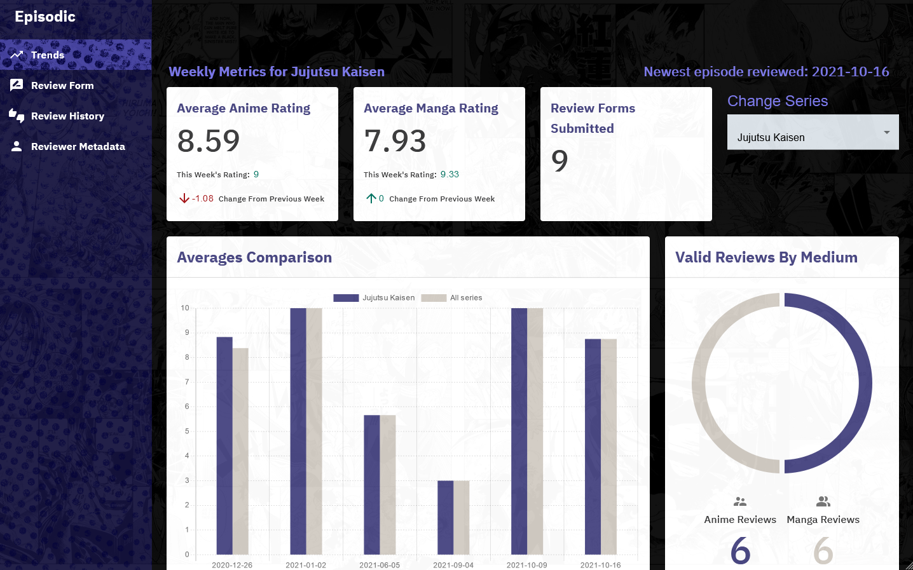
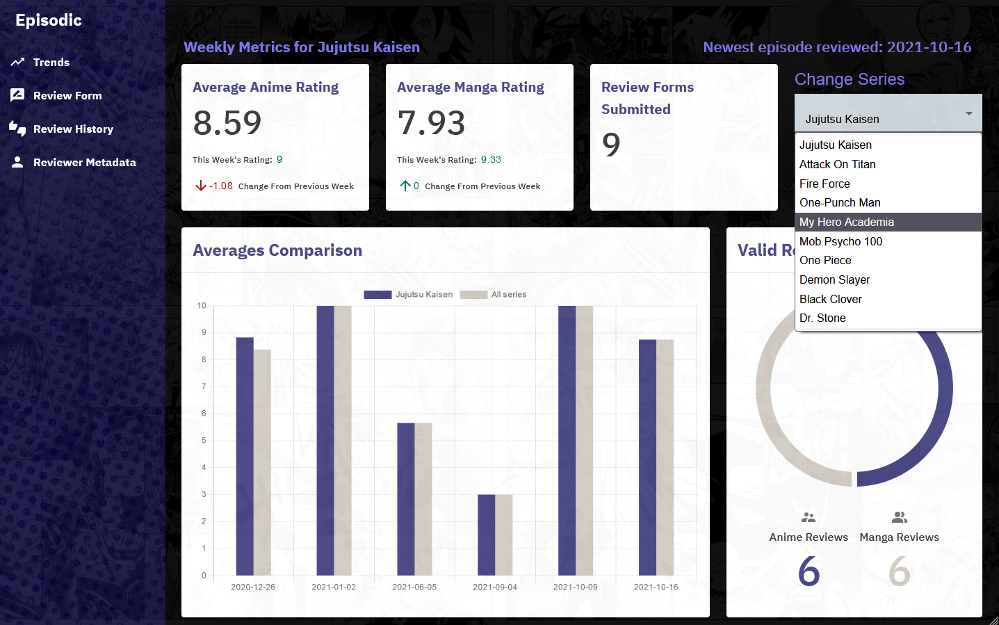
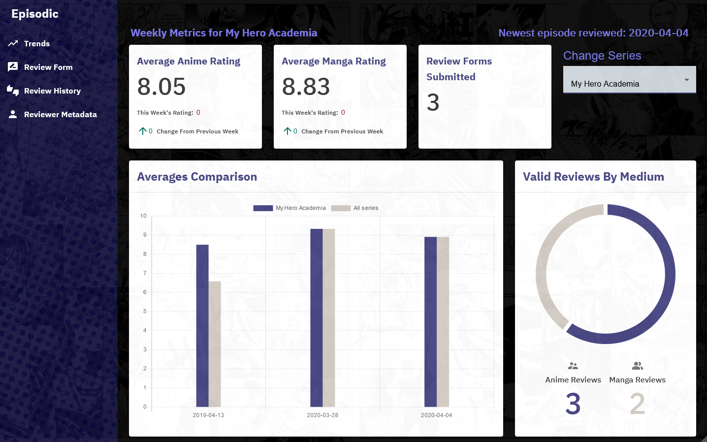
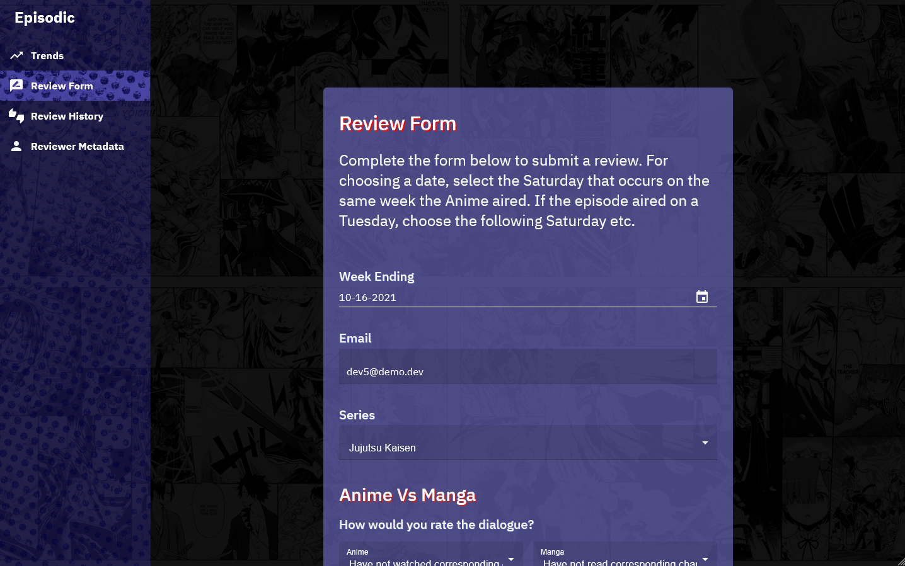
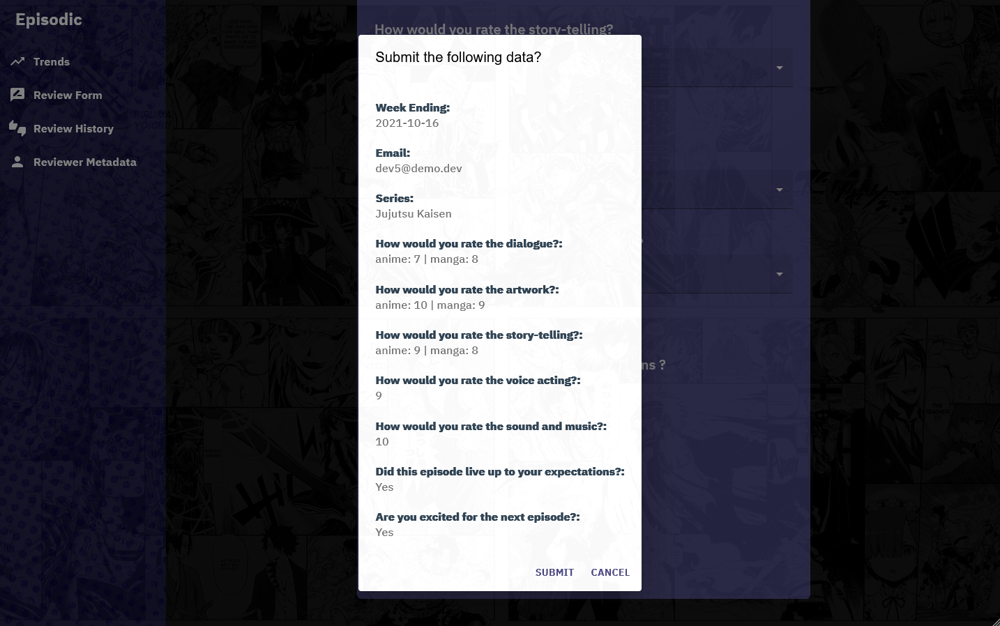
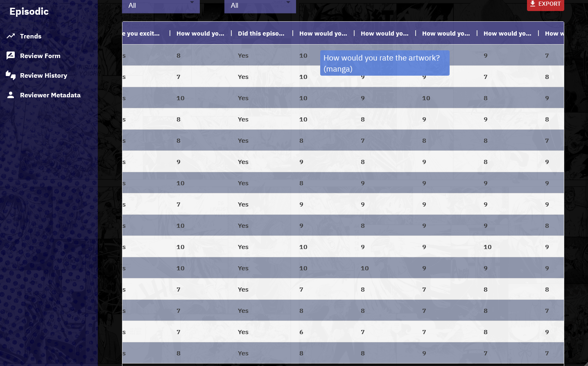
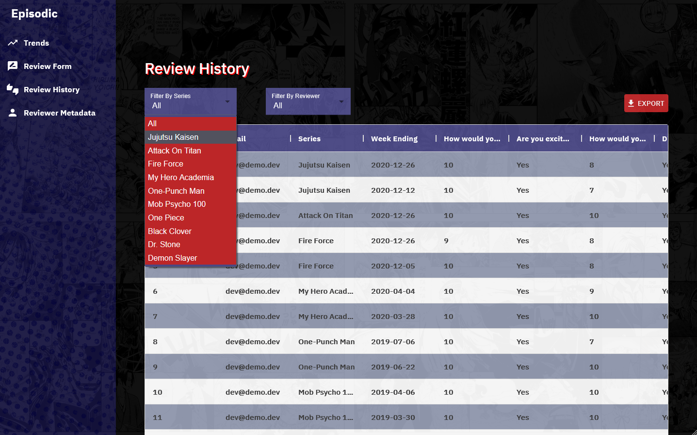
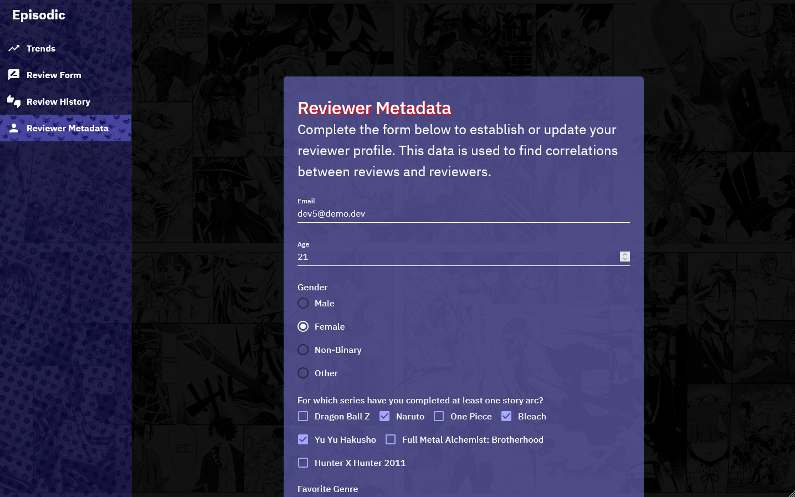
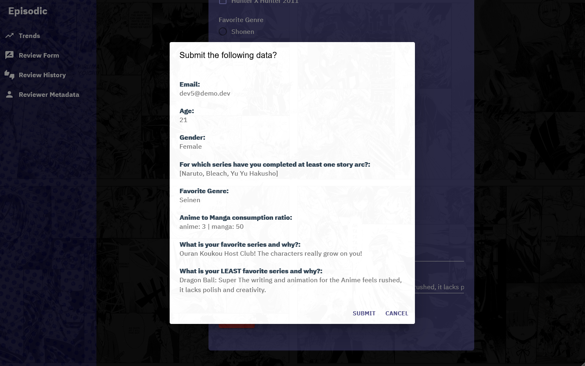

# Episodic
Episodic was created for the sole purpose of demonstrating experience with certain technologies and patterns. It began as an abridged version of the "Weekly Absence Tracker", but distinguishes itself enough to have become a spiritual successor in some regards. In any event, the themes used in Episodic were excercised as a way to make it unique, but serves no practical purpose.

Episodic lets users share reviews for episodic Anime releases. The idea being that it could be adapted into a platform where users can share their excitement and passion for a current series while exploring the merits of a given show with broadened perspective. Users can also share facts about themselves which can later be used to explore potential correlations between reviews and reviewer.

Episodic currently has four views / web pages: "Trends", "Review Form", "Review History", and "Reviewer Metadata". Screenshots and descriptions for each view can be found in the Screenshots section below.

### Technologies Used
* React.js
* JavaScript
* Python
* PostgreSQL
* PL/pgSQL
* HTML/CSS
* Material UI
* AWS Lambda
* AWS API Gateway
* AWS RDS
* AWS Amplify

# Screenshots

# Landing page / dashboard

# Series dropdown
Users can view a dashboard for each series.

# After selecting series One Piece

# Review Form page #1
Users can submit reviews for an episode here.

# Review Form page #2

# Review Form page #3

# Prompt for confirming review before submission

# After successful submission
The form (and React state) reset upon submission thus allowing successive submissions without reloading.

# Review History page
User can view and download all review submissions here.

# The code features an algorithm that separates questions into appropriate distinctions

# Reviews can be filtered by series and reviewer

# After filtering for the review submitted earlier

# Firefox prompting for download after clicking EXPORT button

# Downloads correspond to filtered data

# Reviewer Metadata page #1

# Reviewer Metadata page #2

# Reviewer Metadata page #3

# After successful submission

# Data displayed on Reviewer Metadata page corresponds with database
